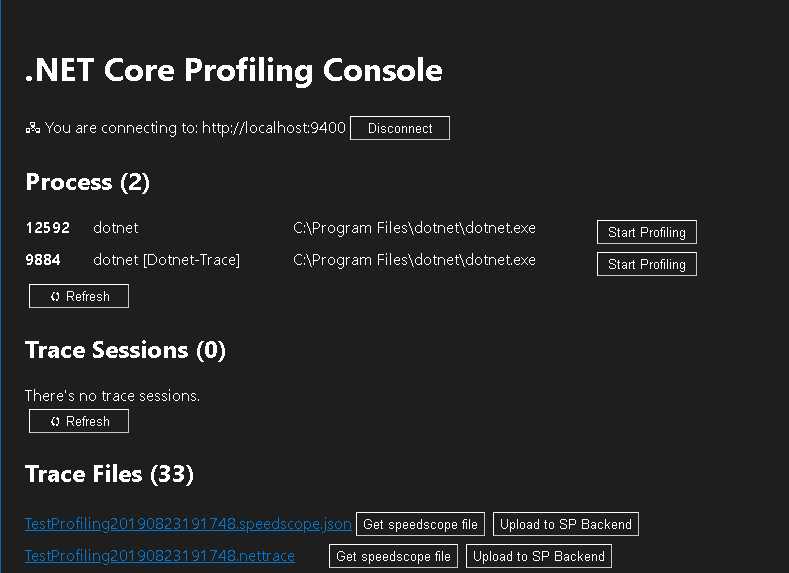

# .NET Core Diagnostics - Fancy Trace

This is a fork of the [.NET Core Diagnostics Repo](https://github.com/dotnet/diagnostics) intending to provide a better experiences/solutions for dotnet-trace tool of .NET Core 3.0.

## Motivation

> [**Rules of Optimization**](http://wiki.c2.com/?RulesOfOptimization)  
First rule of optimization - Dont't  
Second rule of optimization - Don't...yet.  
ProfileBeforeOptimizing  
-- [Michael Jackson](http://wiki.c2.com/?MichaelJackson)

If I ran to rule 3, I probably wanted the performance profiling to happen easily.

.NET Core 3.0 provides CLI tools to do the profiling.

* Although the command line is a cross platform solution, it is not as easy as button clicks.
* Once the trace is gathered, it is not easy to get the trace when it is inside a container or hosted remotely.

This repo does an experiment to put a web UI on top of the command lines to make it easier to use for various scenarios: premises box, locally hosted container, Azure container. Also, the web UI will stream the trace file gathered by dotnet-trace allows offline analysis.

## Road map

1. Provide a story for on premises profiling.
1. Run it in local hosted containers, provides a way to easily fetch the trace files.
1. Extend it to run in Azure.

## Develop status

The implementation is provided at [src/Tools/dotnet-trace-hosted](./src/Tools/dotnet-trace-hosted) and [src/Tools/dotnet-trace-hosted-webui](./src/Tools/dotnet-trace-hosted-webui). Here's how the UI looks like today:

## Architecture

// TODO: Add more details here.

## Using SOS

* [SOS debugging for Linux/MacOS](documentation/sos-debugging-extension.md)
* [SOS debugging for Windows](documentation/sos-debugging-extension-windows.md)
* [Debugging a core dump](documentation/debugging-coredump.md)

## Tools

* [dotnet-dump](documentation/dotnet-dump-instructions.md) - Dump collection and analysis utility.
* [dotnet-trace](documentation/dotnet-trace-instructions.md) - Enable the collection of events for a running .NET Core Application to a local trace file.
* [dotnet-counters](documentation/dotnet-counters-instructions.md) - Monitor performance counters of a .NET Core application in real time. 

## New Features

The `bpmd` command can now be used before the runtime is loaded. You can load SOS or the sos plugin on Linux and execute bpmd. Always add the module extension for the first parameter.

    bpmd SymbolTestApp.dll SymbolTestApp.Program.Main

You can set a source file/line number breakpoint like this (the fully qualified source file path is usually not necessary):

    bpmd SymbolTestApp.cs:24

Symbol server support - The `setsymbolserver` command enables downloading the symbol files (portable PDBs) for managed assemblies during commands like `clrstack`, etc. See `soshelp setsymbolserver` for more details.

    (lldb) setsymbolserver -ms

Before executing the "bt" command to dump native frames to load the native symbols (for live debugging only):

    (lldb) loadsymbols

To add a local directory to search for symbols:

    (lldb) setsymbolserver -directory /tmp/symbols

## Useful Links

* [FAQ](documentation/FAQ.md) - Frequently asked questions.
* [The LLDB Debugger](http://lldb.llvm.org/index.html) - More information about lldb.
* [SOS](https://msdn.microsoft.com/en-us/library/bb190764(v=vs.110).aspx) - More information about SOS.
* [Debugging CoreCLR](https://github.com/dotnet/coreclr/blob/master/Documentation/building/debugging-instructions.md) - Instructions for debugging .NET Core and the CoreCLR runtime.
* [dotnet/coreclr](https://github.com/dotnet/coreclr) - Source for the .NET Core runtime.
* [Official Build Instructions](documentation/building/official-build-instructions.md) - Internal official build instructions.

[//]: # (Begin current test results)

## Build Status

[//]: # (End current test results)

## License

The diagnostics repository is licensed under the [MIT license](LICENSE.TXT). This project has adopted the [Microsoft Open Source Code of Conduct](https://opensource.microsoft.com/codeofconduct/).  For more information see the [Code of Conduct FAQ](https://opensource.microsoft.com/codeofconduct/faq/) or contact [opencode@microsoft.com](mailto:opencode@microsoft.com) with any additional questions or comments.

## Disclaim

I currently work for Microsoft. However, this project is a pure hobby and is not funded by Microsoft.
