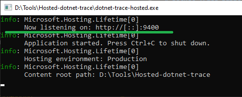
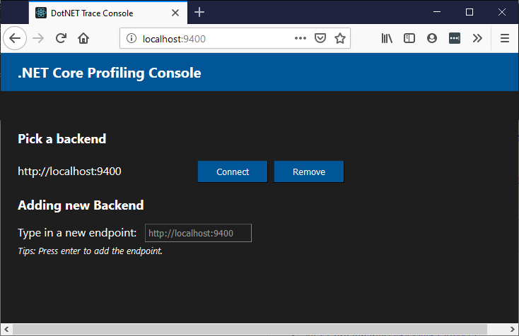
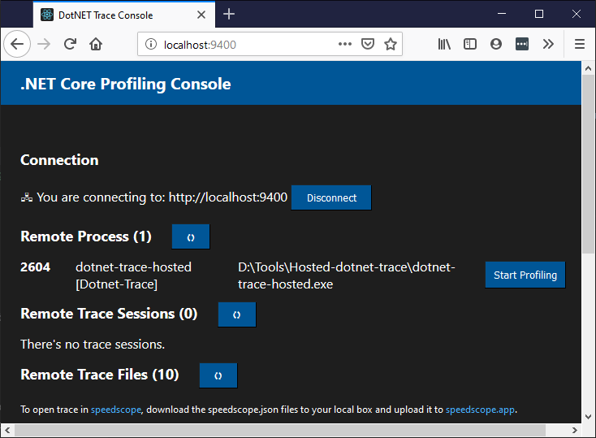

# Dotnet Trace (Profiling) Basic Usage (Windows)

This is a quick guide to use the hosted dotnet-trace tool on Windows. You will need [.NET Core 3.0 Preview 8](https://dot.net).

## Get Started

* Download the released binaries here: [win-x64](https://github.com/xiaomi7732/diagnostics/releases/download/dotnet-trace-hosted-0.0.1/dotnet-trace-hosted.v0.0.1.win-x64.zip).
  * Find more release [here](https://github.com/xiaomi7732/diagnostics/releases/).

* Extract the zip file downloaded.

* Run the executable:

  ```bash
  dotnet-trace-hosted.exe
  ```

* It will start listening on port 9400:

  

* Navigate to [http://localhost:9400](http://localhost:9400) from a browser to bring up the frontend.

  

  * Click `Connect` to hook up frontend with the backend.

* Now you can choose a process to start profiling.

  

  * Click `Start Profiling` to the right of a process to start profiling;
  * Click `Stop Profiling` to the right of a session to stop profiling;

* Once stopped, after rundown, the trace file (.NETTRACE) will show up in the `Trace File` section.
  * Click on the file to download it to your local box.
  * Click 'Get speedscope file' to convert the trace file to speedscope file.

* Have fun and shoot us feedback on [Issus](https://github.com/xiaomi7732/diagnostics/issues).
